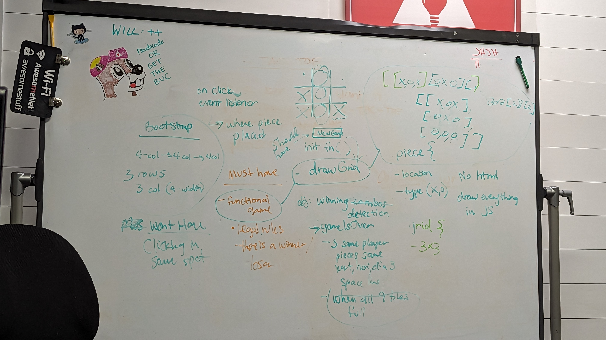

Objects
- game piece
    - which player (x or o, user or computer)
    - isKinged
- game grid 
    - an array
    - 3x3 multidimensional array with 9 indexes
        - 3 rows of 3 cols
        - bootstrap 4 col each

Arrays
- track all the different moves
- tiles on board
Methods
- init - render board
- drawGrid
- 

MOSCOW in Eisenhower ---------------------

**Urgent and Important (Do First):**
- **Must-Haves (M):**
   - Implement Game Logic: 
    - Developing the core game logic for Tic-Tac-Toe, including the board, player turns, and win/lose conditions, is a top priority.
   - User Interface for Gameplay: Creating a functional user interface that allows players to interact with the game is essential for basic gameplay.
**Not Urgent but Important (Schedule):**
- **Should-Haves (S):**
   - Multiplayer Mode: While not immediately urgent, planning for multiplayer functionality should be scheduled to enhance the game's appeal.
   - AI Opponent (Single-Player Mode): Developing an AI opponent for single-player mode is important for user engagement and should be scheduled.
**Urgent but Not Important (Delegate):**
- **Could-Haves (C):**
   - Sound Effects and Animations: Implementing sound effects and animations, while enhancing the user experience, can be delegated to a graphic designer or sound engineer.
   - Game Statistics and Leaderboards: Developing features for tracking game statistics and leaderboards can be delegated to another team member.
**Not Urgent and Not Important (Eliminate or Postpone):**
- **Won't-Haves (W):**
   - Online Multiplayer (Beyond Local): Integrating online multiplayer capabilities might be a long-term goal but is not necessary for the initial release and can be postponed.
   - Advanced AI with Machine Learning: While an exciting feature, creating an advanced AI using machine learning can be eliminated or considered for future iterations.

